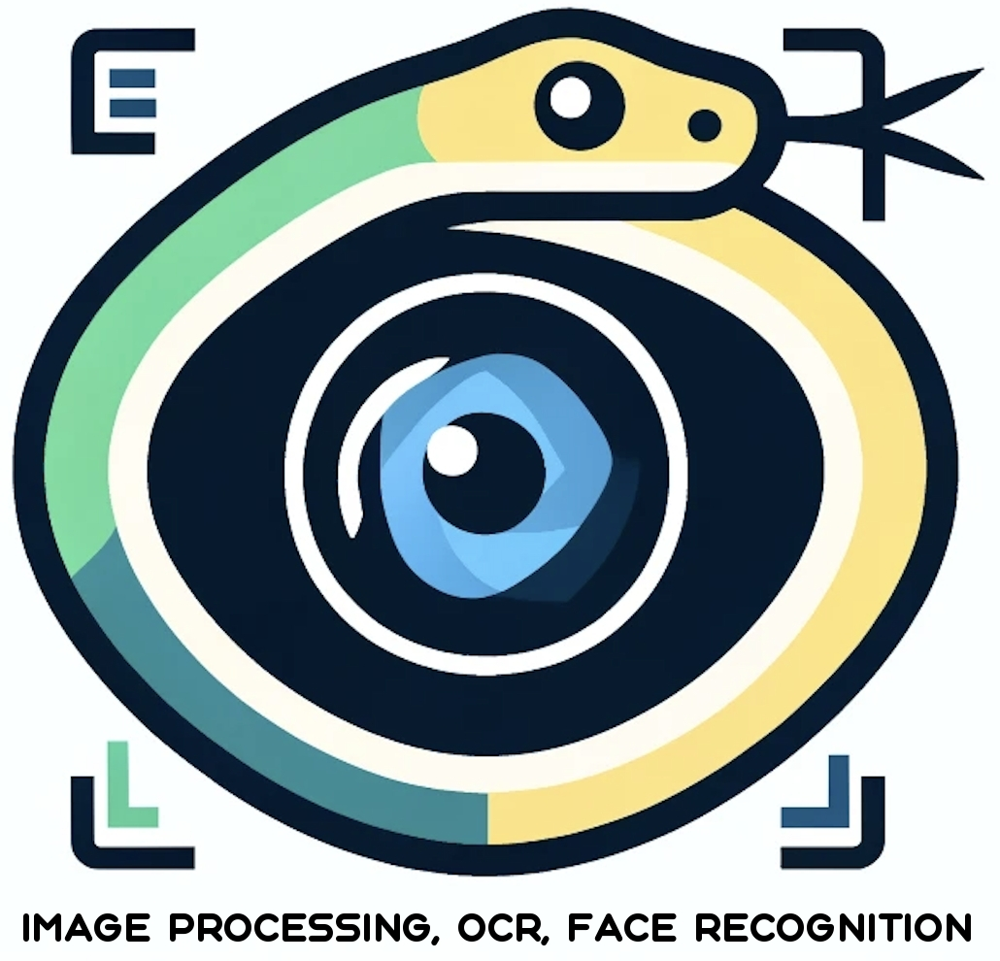
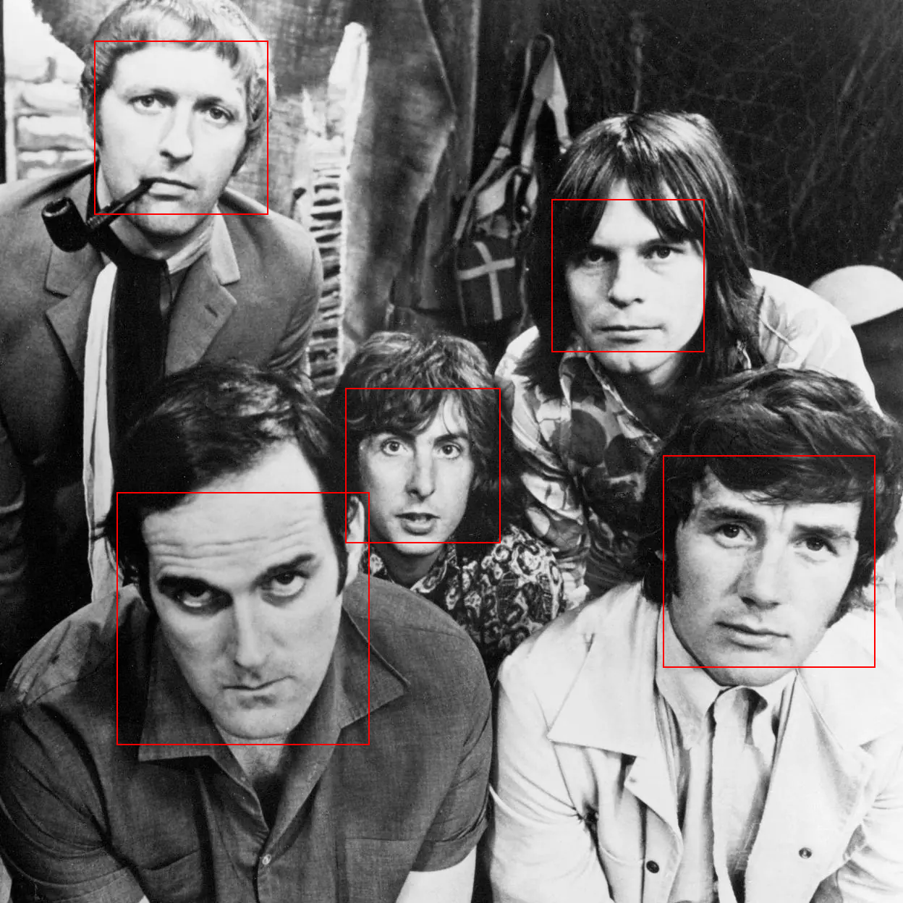

## The pyiof library

`pyiof` stands for Python **Image processing**, **OCR** and **Face Recognition**

This library is designed mainly to facilitate :
- `OCR` - text recognition from images (English only for now)
- `Faces recognition` on images

Additionally, it also provides `image processing` capabilities, which support the OCR and
Face Recognition modules, but can be used individually for other purposes. It includes:
- Grayscaling
- Binarization
- Cropping
- Drawing
- Get image size

 
`pyiof` leverages the Python Imaging Library (PIL) and other libraries like numpy and OpenCV 
 for handling image data.


## Extensibility

The `pyiof` library is designed with extensibility in mind, utilizing abstract base classes to define 
interfaces for image management, processing, . This approach allows developers to extend the 
functionality by implementing custom versions of these interfaces to meet specific requirements.

Concrete implementations of these interfaces are provided in `pyiof`

### Interfaces

To provide Face Recognition capabilities, the class `FaceRecognizer` needs an implementation of interface:
- `ICascadeClassifiersLoader`: Loads cascade classifier files to use for faces detection

To provide `OCR` capabilities, the class `OCRProcessor` needs an implementation of interface:

- `IDictionaryManager`: Loads an English dictionary and provide method to check if a word is in such dictionary.
This is necessary to measure the accuracy of several OCR operations performed and choose the best output.

Both classes also need an implementation of interface `IImageProcessor` which handles all image processing operations needed


### Provided Implementations

`pyiof` provides implementations of interfaces:

- **IImageProcessor**: Class `ImageProcessor` - Handles image transformations like grayscale conversion, binarization, and drawing.
- **ICascadeClassifiersLoader**: Class `CascadeClassifiersLoader` Handles loading cascade classifier files
- **IDictionaryManager**: Class `DictionaryManager` Handles loading and using an English dictionary

### Additional Provided Classes

- **ImageFilesManager**: Class that implements image files load and save.

## OCR Module 

The `ocr` submodule is designed to handle optical character recognition (OCR) tasks, integrating text extraction from images with dictionary validation to assess text accuracy. It uses `pytesseract` for OCR and custom dictionary management to verify the extracted words.

The main class is **OCRProcessor**, which provides method ` extract_text` that provides text found
on a PIL Image. It uses different binarization with different thresholds on an image and extracts text from all 
of them, the most accurate OCR result is provided as result.


### Components

#### Dictionary Manager

Implements the `IDictionaryManager` interface to manage and check words against a dictionary.

#### OCR Processor
Utilizes DictionaryManager to verify the OCR results and uses image processing to optimize text extraction.

Example of OCR on image **canary_islands.png** (located in the test resources dir)


```python
from pyiof.ocr.ocr_processor import OCRProcessor
from pyiof.ocr.dictionary_manager import DictionaryManager
from pyiof.img_processing.image_processor import ImageProcessor
from pyiof.img_processing.image_files_manager import ImageFilesManager

# Initialize the necessary components
dictionary_manager = DictionaryManager()
image_processor = ImageProcessor()
ocr_processor = OCRProcessor(dictionary_manager, image_processor)
image_files_manager = ImageFilesManager()

# Load image
image_source = '../pyiof/tests/resources/test_images/canary_islands.png'
image = image_files_manager.load_image(image_source)

# Extract text
ocr_result = ocr_processor.extract_text(image)
print(ocr_result.text)
```
Result
```text
Thousands protest against Canary
islands’ ‘unsustainable’ tourism model

Local people say archipelago’s outdated industry made life
unaffordable and prompts environmental emergencies

@ Eleven members of Canarias se Agota have been on hunger strike for a week ta protest against
the construction of two large luxury developments in southern Tenerife. Photograph: Désirée
Martin/AFP/Getty

Thousands of people will join protests across the Canary islands on Saturday
to call for an urgent rethink of the Spanish archipelago’s tourism industry
and a freeze on tourist numbers, arguing that the current, decades-old model
has made life unaffordable and environmentally unsustainable for local
people.

The protests - which will take place under the banner “Canarias tiene un
limite” (The Canaries have a limit) - are being backed by environmental
groups including Greenpeace, WWF, Ecologists in Action, Friends of the
Earth and SEO/Birdlife.

“We’ve reached the point where the balance between the use of resources
and the welfare of the population here has broken down - especially over the
past year,” said Victor Martin, a spokesperson for the Canarias se Agota (The
Canaries Have Had Enough) collective, which is helping to coordinate
Saturday’s protests across the eight islands.
```
## Face Recognition Module 

The `face_recognition` submodule is designed to detect and process faces in images using OpenCV's cascade classifiers. 
This submodule includes components for loading cascade classifiers, recognizing face regions, and performing image
operations such as highlighting faces.


The main class is **FaceRecognizer**, which provides methods:

- **get_faces_regions** - provides all regions where faces are found on an image
- **get_faces_images** - provides a list of PIL Images with faces found on an image
- **highlight_faces_on_image** - Surrounds with a red rectangle all faces found on an image


### Components

#### Cascade Classifiers Loader

Responsible for loading the necessary OpenCV cascade classifiers from specified files.

####  Face Recognizer

Uses an implementation of ICascadeClassifiersLoader to load cascade classifiers to be able to identify faces
on an image.

Example of faces recognition on image **tests/resources/test_images/monthy-python.webp**

```python
from pyiof.face_recognition.face_recognizer import FaceRecognizer
from pyiof.face_recognition.cascade_classifiers_loader import CascadeClassifiersLoader
from pyiof.img_processing.image_processor import ImageProcessor
from pyiof.img_processing.image_files_manager import ImageFilesManager

# Initialize the necessary components
cascade_classifiers_loader = CascadeClassifiersLoader()
image_processor = ImageProcessor()
face_recognizer = FaceRecognizer(cascade_classifiers_loader, image_processor)
image_files_manager = ImageFilesManager()

# Load image
image_source = 'tests/resources/test_images/monthy-python.webp'
image = image_files_manager.load_image(image_source)

# Extract faces regions
face_recognition_result = face_recognizer.get_faces_regions(image)
regions = face_recognition_result.faces_regions
print(regions)

# Highlight faces
face_recognizer.highlight_faces_on_image(image, regions).show()
```
Result
```text
[array([130,  56, 240, 240], dtype=int32), array([762, 275, 211, 211], dtype=int32), array([477, 536, 214, 214], dtype=int32), array([916, 629, 293, 293], dtype=int32), array([161, 680, 349, 349], dtype=int32)]
```


## Installation

1. Clone or download this repository
2. From root execute:
```bash
python3 -m pip install . 
```

This will install the pyiof library:


```bash
.
.
.

Successfully built pyiof
Installing collected packages: pyiof
Successfully installed pyiof-0.1.0
```

## Uninstall
```bash
python3 -m pip uninstall pyiof 
```

## Releases

- v 0.1.0 - April 22, 2024
